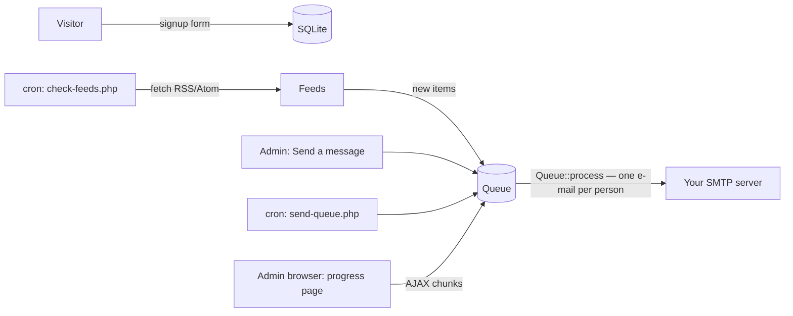

# Notify Me List

A simple, self-hosted PHP mailing list: people subscribe (single or double
opt-in, your choice), receive your messages and/or the new articles of the
RSS/Atom feeds they picked, manage their subscription themselves, and can
unsubscribe in one click. One list per install, no passwords anywhere
(magic links by e-mail), no external service, no tracking.

Made for **ordinary cPanel shared hosting** (o2switch, etc.): upload the files
by FTP or the File Manager, open a URL, done. No Composer, no build step, no
Docker, no daemon. MIT licensed, every line is in this repository.

> The interface and e-mails are available in **French (default) and
> English** — pick the language on the first screen of the installer, change it
> later in the settings. All texts live in one file per language,
> `notifyme/lang/fr.php` and `notifyme/lang/en.php` (see
> [Translating](#translating)). Screen names below are given in English, with
> the French label in brackets when it helps.

---

## Contents

1. [Features](#features)
2. [Requirements](#requirements)
3. [What is in the package](#what-is-in-the-package)
4. [Installation on cPanel, step by step](#installation-on-cpanel-step-by-step)
5. [The two cron jobs](#the-two-cron-jobs)
6. [Logging in to the admin](#logging-in-to-the-admin)
7. [Everyday use](#everyday-use)
8. [Customising](#customising)
9. [Security and data protection](#security-and-data-protection)
10. [Limitations — please read](#limitations--please-read)
11. [Troubleshooting](#troubleshooting)
12. [Updating, backing up, reinstalling](#updating-backing-up-reinstalling)
13. [For developers](#for-developers)
14. [License](#license)

---

## Features

**Public side**
- Signup form: e-mail + **mandatory, non-pre-ticked consent checkbox** linking
  to your privacy policy + one checkbox per feed + a "general list" checkbox
  (its label is configurable). Without feeds, the form falls back to the
  general list only.
- Stored for each subscriber: e-mail, date, IP address, the **exact consent
  text shown**, and the choices made.
- **Single opt-in** (default: active at once + welcome e-mail) or **double
  opt-in** (confirmation e-mail first). A switch in the settings, changeable
  at any time.
- **"Manage my subscription"** by magic link: see the stored data, add/remove
  individual feeds or the general list, delete everything. Removing the last
  subscription asks whether to unsubscribe completely or keep the address.
- **One-click unsubscribe** link in every e-mail (plus the `List-Unsubscribe`
  / `List-Unsubscribe-Post` headers used by Gmail, Yahoo, Apple Mail).

**Admin side** (magic-link login, no password)
- Dashboard: counts (overall, per feed, pending), paginated searchable list,
  health warnings (SMTP not set, cron not running, failing feeds…).
- **Send a message**: subject + text or simple HTML, preview, send now or
  **schedule** for later. One individual e-mail per subscriber (never a BCC
  blast), each with its own unsubscribe link, in batches with a delay, hourly
  and daily caps, and automatic pausing when the host reports its sending
  quota is reached. Live progress bar in the browser (chunked AJAX), with the
  cron job as a background relay.
- **Bounces**: dead addresses are detected (SMTP refusals, and bounce e-mails
  read from your mailbox over IMAP) and deactivated automatically.
- **Feeds**: add / edit / pause / delete RSS or Atom feeds (auto-detected),
  each with its own check frequency, subscriber count and error status.
- SMTP settings with an encrypted password and a **test e-mail** button.
- CSV **export** (with consent trail) and CSV **import** (with an explicit
  "imported by the admin on …" consent note).

**Feed monitoring**
- Real cron, never "visitor-triggered pseudo-cron".
- Each feed is checked in isolation (one broken feed never stops the others).
- Items are remembered by GUID/id, else link, else hash(title+date): nothing is
  ever sent twice, even across restarts.
- The first check only records the existing items (**no dump of the whole
  history** on subscribers).
- Only the subscribers of a feed receive its items; someone following several
  feeds gets **one e-mail per cycle**, grouped by feed.
- One central, neutral HTML template for these e-mails, with a plain-text twin.



---

## Requirements

| Needed | Why | Where to enable it on cPanel |
|---|---|---|
| PHP **7.4 or newer** (8.x fine) | | *Select PHP Version* / *MultiPHP Manager* |
| `pdo_sqlite` (+ `sqlite3`) | database | *Select PHP Version › Extensions* |
| `openssl` | SMTP password encryption, TLS | usually on |
| `mbstring` | UTF-8 text | usually on |
| `dom` (DOMDocument, part of `xml`) | reading RSS/Atom | usually on |
| `curl` *(recommended)* | fetching feeds (falls back to PHP streams) | usually on |
| An SMTP account | sending e-mails | any mailbox you own: *Email Accounts* in cPanel |
| Cron jobs *(strongly recommended)* | feed checks, background sending | *Cron Jobs* in cPanel |

The installer checks all of this and tells you exactly what is missing. If
`pdo_sqlite` is absent, every page stops with a clear message instead of
half-working.

---

## What is in the package

```
notifyme/                  PRIVATE: code + data. Ideally OUTSIDE public_html.
├── bootstrap.php
├── lib/                   application code (SMTP client, feeds, queue…)
├── lang/fr.php, en.php    ALL interface and e-mail texts, one file per language
├── templates/
│   ├── email/feed-digest.html.php   ← the feed e-mail template (edit freely)
│   ├── email/feed-digest.txt.php    ← its plain-text version
│   ├── email/layout.html.php        ← layout of messages / transactional mails
│   └── layout-*.php                 page layouts
├── cron/
│   ├── check-feeds.php    cron job #1
│   ├── send-queue.php     cron job #2
│   └── admin-link.php     prints an admin login link (SSH users)
├── data/                  created at install: database, keys, logs (must be writable)
└── config.local.php.example
www/                       PUBLIC: what visitors reach.
├── index.php              signup form
├── manage.php             self-service
├── unsubscribe.php  confirm.php  privacy.php
├── install.php            one-time setup wizard (delete it afterwards)
├── admin/                 admin pages
├── assets/                CSS + JS
└── .htaccess
docs/nginx.conf.example    if you ever move to nginx
```

---

## Installation on cPanel, step by step

### 1. Download

Go to the repository's **Releases** page (right-hand column on GitHub) and
download `notify-me-list-<version>.zip` from the latest release. Unzip it on
your computer: you get the `notifyme` and `www` folders plus this README.
(The green *Code › Download ZIP* button works too, but also contains the test
suite, which you do not need on the server.)

### 2. Upload — choose a layout

**Layout A — recommended (database outside the web root)**

Your cPanel home folder looks like `/home/youruser/` and contains
`public_html/`.

1. Upload the **`notifyme` folder** into `/home/youruser/` → you get
   `/home/youruser/notifyme/` (next to `public_html`, so nobody can ever
   download it from the web).
2. Upload the **contents** of `www` (not the folder itself) where the form
   should live, for example into a new folder
   `/home/youruser/public_html/newsletter/`.

The public pages find the private folder automatically (they look for a
`notifyme` folder up to 4 levels above them). If yours is elsewhere, copy
`www/notifyme-path.php.example` to `notifyme-path.php` and write the path in it.

**Layout B — everything inside the web root**

If you cannot write outside `public_html`, upload the contents of `www` into
e.g. `public_html/newsletter/`, then upload the `notifyme` folder **inside**
it (`public_html/newsletter/notifyme/`). The `.htaccess` files deny all web
access to it. This is safe on Apache/LiteSpeed (all cPanel hosts); on nginx,
see `docs/nginx.conf.example`.

> Tip: with the File Manager, upload the ZIP then use *Extract*; it is much
> faster than uploading hundreds of files one by one.

### 3. Permissions

cPanel defaults are fine: folders **755**, files **644**. PHP must be able to
write in `notifyme/data/` (it can with 755 on cPanel since PHP runs as your
user). After installation `notifyme/data/secret.php` is set to 600.

### 4. Run the installer

Open `https://your-domain/newsletter/install.php` **right after uploading**
(until it is completed, anyone who finds the URL could run it). It:

- lets you choose the language (Français / English, top of the page),
- checks PHP and the extensions,
- asks for the site name, **your e-mail** (admin login + default sender), the
  public URL, and your SMTP settings (it can send you a test e-mail),
- creates the secret keys (`notifyme/data/secret.php`) and the database
  (`notifyme/data/notifyme.sqlite`),
- writes `notifyme/data/installed.lock` — while this file exists the wizard
  refuses to run again — and logs you in.

### 5. Delete `install.php`

It is locked, but delete it anyway (the dashboard reminds you until you do).

### 6. Turn on the two cron jobs

Admin › **Cron jobs** (*Tâches cron*) can add them for you — see the next
section.

### 7. Share the form

Link to `https://your-domain/newsletter/` from your site.

---

## The two cron jobs

Yes, cPanel supports cron jobs (*Advanced › Cron Jobs*). Notify Me List needs
two of them. The admin page **Cron jobs** (*Tâches cron*) shows whether they
run (last execution time of each) and offers three ways to create them, from
the easiest to the most manual:

1. **One click, via `crontab`** — on hosts that let PHP run the `crontab`
   command, an *Install the cron jobs* button adds the two lines to your
   account's crontab (they then show up in cPanel › Cron Jobs). Your other
   cron jobs are kept; clicking again replaces our lines instead of
   duplicating them; a *Remove* button takes them out. Many shared hosts
   block this; the page tells you if yours does.
2. **With a cPanel API token** — in cPanel › *Security › Manage API Tokens*,
   create a token, paste it on the Cron jobs page with your cPanel username
   (pre-filled) and click *Add the jobs through cPanel*. The app calls your own
   cPanel (`https://your-domain:2083`, API 2 `Cron::fetchcron` /
   `Cron::add_line`), adds whatever is missing, and **forgets the token
   immediately** (it is never stored). Delete the token in cPanel afterwards.
3. **By hand** — the page (and the installer's last screen) shows the exact
   commands with **your real paths and PHP binary**; paste them in cPanel ›
   *Cron Jobs* › *Add New Cron Job*:

| Job | Command | Recommended interval |
|---|---|---|
| 1. Check the feeds | `php /home/youruser/notifyme/cron/check-feeds.php >/dev/null 2>&1` | every 15 minutes: `*/15 * * * *` |
| 2. Send queued e-mails | `php /home/youruser/notifyme/cron/send-queue.php >/dev/null 2>&1` | every 5 minutes: `*/5 * * * *` |

In the cPanel form, choose *Once Per Fifteen Minutes* / *Once Per Five
Minutes* (or type `*/15` / `*/5` in *Minute* and `*` everywhere else) and
paste the command.

Notes:
- The PHP program is auto-detected (the command-line PHP of the same version
  as your site, e.g. `/opt/cpanel/ea-php82/root/usr/bin/php` or
  `/opt/alt/php82/usr/bin/php`), falling back to plain `php`. If your host
  documents another path, set it at the bottom of the Cron jobs page; the
  generated lines follow.
- Want an e-mail from cron when something fails? Remove `>/dev/null 2>&1` and
  set the cron e-mail address in cPanel; add `-v` to see what happens.
- The feed frequency you choose per feed (15 min … daily) is honoured only if
  job #1 runs at least that often. Every 15 minutes covers all choices.
- Job #1 also sends a first batch right after queueing, so feed e-mails leave
  quickly even between two runs of job #2.
- Both scripts refuse to run from the web and use lock files, so overlapping
  runs never send twice.
- Test by hand (cPanel › *Terminal*, if available):
  `php ~/notifyme/cron/check-feeds.php --force -v`

### Sending rate limits (shared hosting mail quotas)

cPanel hosts usually cap how many e-mails an account may send per hour
(sometimes also per day). Every list e-mail is sent individually, so the
queue paces itself with five safeguards, all in Admin › Settings › *Sending
pace*:

| Safeguard | Default | What it does |
|---|---|---|
| Pause between two e-mails | 1000 ms | spreads the e-mails out inside a batch |
| E-mails per batch | 20 | per cron run / per browser step |
| Maximum per hour | 200 | rolling 60 minutes; sending stops before the server is contacted |
| Maximum per day | 0 (off) | rolling 24 hours, for hosts with a daily quota |
| Host-limit detection | always on | if the SMTP server still refuses because a quota is reached (e.g. cPanel's *"Domain … has exceeded the max emails per hour … Message discarded"*), the e-mail is **put back in the queue, not marked failed**, and all sending pauses for one hour, then resumes by itself. A banner shows the pause and offers *Resume now*. |

On top of that, a run stops after **5 refusals in a row** (a sign of an
account or server problem rather than bad addresses), so a misconfiguration
can never mark your whole list as failed.

The hourly and daily counts include every e-mail the app sends — welcome,
confirmation and login e-mails too — because the host counts them as well.
Those transactional e-mails are never blocked by the caps (so you can always
log in), they just use up part of the quota.

**Set the maximums a little below your host's published limits.**
Throughput = batch size × runs per hour, capped by those maximums. Defaults:
20 per batch, 1 s apart, every 5 minutes → up to 240/hour, capped at 200/hour.

### Bounces (dead addresses)

When an address stops existing, the recipient's server sends an error e-mail
back (a *bounce*). Sending again and again to dead addresses hurts your
sender reputation and wastes your hosting quota, so Notify Me List handles
them (Admin › **Bounces**, *Retours* in French):

- **At send time**: a permanent refusal by your SMTP server (e.g. `550 5.1.1
  user unknown`) counts immediately. Nothing to configure.
- **Later, in your mailbox**: tick *Read bounces automatically*. The feed cron
  job then reads the mailbox that receives the errors over IMAP, at most every
  15 minutes (or click *Read the mailbox now*). By default it is the SMTP
  account's own mailbox with the same credentials — on cPanel, same server,
  port 993. Use *Test the connection* first.
- It understands standard delivery reports (RFC 3464: Gmail, Outlook,
  Postfix…) and cPanel/Exim's `X-Failed-Recipients` messages. Delay warnings
  and out-of-office replies are ignored. Only the bounce e-mails themselves
  are marked as read (or deleted, or left alone — your choice); all your other
  mail stays untouched and unread.
- **Permanent error** (address or domain does not exist): the subscriber is
  deactivated after 1 of them (configurable). **Temporary error** (mailbox
  full, anti-spam refusal, outage): after 5 within 30 days (configurable).
- A deactivated subscriber receives nothing, appears on the Bounces page and
  in the dashboard filter, and can be reactivated or deleted by you. If they
  sign up again themselves, they start over normally.
- Optional *Return-Path*: send bounces to another address than the sender
  (e.g. a dedicated `bounces@yourdomain` mailbox). Some SMTP servers only
  accept the account's own address here — keep it empty if sending fails.
- No PHP `imap` extension needed (it is often missing, and removed from PHP
  8.4): the IMAP client is built in.

### What if I have no cron at all?

- **Sending still works**: keep the campaign page open in your browser, it
  sends batch after batch by itself. If you close it, sending pauses and
  resumes when you reopen the page (*Sendings* menu). The same page sends queued
  feed e-mails.
- **Feeds are NOT checked automatically.** There is deliberately no
  "check when someone visits" trick (it is unreliable on low-traffic sites and
  slows visitors down). You can still click *Check* on the Feeds page to
  check a feed by hand. Without cron, feed notifications are therefore manual.
- The dashboard warns you when a cron job has not run recently.

---

## Logging in to the admin

Go to `…/newsletter/admin/`, type the admin e-mail, click the link you receive
(valid 15 minutes, single use), then click *Log me in*.

Why a button after the link? Many mail providers' security scanners "click"
every link in incoming mail. If the link logged in (or confirmed a
subscription) by itself, the scanner would burn it before you. Showing one
button, which scanners do not press, avoids that. The same applies to the
self-service link and the double opt-in confirmation.

Requests are limited to **3 e-mails per address and 10 per IP address per 15
minutes**, and the page answers the same way whether or not the address is the
admin's (no way to probe it).

### Emergency access (e-mail broken, cannot receive the link)

1. With the cPanel File Manager, create an **empty file** named
   `emergency-login.txt` in `notifyme/data/`.
2. Reload the admin login page: an *Emergency login* button appears for one
   hour. Clicking it logs you in once and deletes the file.

Anyone who can create files in your hosting already controls everything, so
this does not weaken security. With SSH you can instead run
`php ~/notifyme/cron/admin-link.php` which prints a login link.

---

## Everyday use

- **Opt-in mode** — Admin › Settings › *Signup mode*. Switching is
  instant; existing active subscribers are unaffected; pending ones stay
  pending (their confirmation links keep working). Unconfirmed signups are
  deleted after N days (30 by default).
- **Send a message** — pick the recipients (general list — the default —, the
  subscribers of one feed, or everyone), write in plain text (links become
  clickable) or simple HTML, *Preview*, then *Send* to queue. You are
  taken to the progress page; failed addresses are listed and can be retried.
  Temporary SMTP errors (4xx) are retried automatically (3 attempts).
- **Schedule a message** — in the composer, choose *Schedule for* and a date
  and time (in the time zone set in Settings). The message waits in *Sendings*
  as *Scheduled*, where you can change the date, send it now or cancel it. The
  recipient list is built when it starts, so people who subscribed or left in
  the meantime are handled correctly. It needs the sending cron job: the
  message leaves within 5 minutes of the chosen time (the dashboard warns if a
  scheduled message is late).
- **Feeds** — add a name + URL + frequency. The feed is fetched at once to
  validate it and to record its current items as the starting point. Tick
  *Also send to the subscribers of "<general list name>"* to deliver a feed to
  the general list as well ("sent to everyone" feeds). Pausing a feed stops checks
  and hides it from the form; subscribers stay linked.
- **Import** — CSV file or pasted list, one address per line or a column named
  `email` (`;`, `,` or tab detected). Choose the lists, describe where consent
  came from, and tick the attestation. Consent is stored as
  "Imported manually by the administrator (you@…) on 2026-09-26 14:03 — your
  note" (in the interface language). Already-known addresses only get the extra lists; their own consent
  trail is kept.
- **Export** — CSV with e-mail, status, signup/confirmation dates, IP, consent
  text, origin, general list yes/no, feeds, choices at signup. Semicolon
  (Excel in French and other European locales) or comma. Formula-looking cells are neutralised.

### Unsubscribe behaviour

- The link in every e-mail removes the subscriber **entirely** (all feeds +
  general list + the record itself) immediately, and shows a confirmation page.
- Mail clients' built-in "Unsubscribe" button (RFC 8058) does the same.
- To remove only one feed, people use *Gérer mon abonnement*.
- If you notice people being unsubscribed by their company's link scanner,
  tick *Ask for a confirmation click on the unsubscribe page* in the settings: the page then asks
  for one click first (the mail-client button stays immediate).

---

## Customising

### Translating

French (`fr.php`) and English (`en.php`) are included. To add a language:

1. Copy `notifyme/lang/en.php` to e.g. `notifyme/lang/de.php`.
2. Translate the values (keep the keys and the `{placeholders}`); set
   `'language.name'` to the language's own name.
3. It appears automatically in the installer and in Admin › Settings ›
   *Language*. Missing keys fall back to French.

Switching language changes the interface and automatic e-mails. Texts you
typed yourself (list name, consent text, feed e-mail subject, privacy text)
are stored as typed: adapt them in the settings. You can also force a
language with `define('NM_LANG', 'en');` in `notifyme/config.local.php`.

### E-mail look

- Feed notifications: `notifyme/templates/email/feed-digest.html.php` (HTML,
  inline styles for mail-client compatibility) and `feed-digest.txt.php`
  (plain-text part). Variables are documented at the top of the file.
- Messages, welcome, confirmation, login e-mails:
  `notifyme/templates/email/layout.html.php` / `layout.txt.php`.
- Wording: `notifyme/lang/fr.php` / `en.php`.

### Pages

`www/assets/style.css` (neutral default, dark mode aware) and
`notifyme/templates/layout-public.php`. The signup page can be linked or
opened in an iframe **from the same domain** (other domains are blocked by
`X-Frame-Options`).

---

## Security and data protection

- All SQL through PDO prepared statements; all output HTML-escaped.
- CSRF token on every state-changing form (admin and public). Deliberate
  exceptions: token links (unsubscribe, magic links, confirmation), where the
  unguessable token *is* the authorisation.
- No password is ever created or stored — admin and subscribers use the same
  single-use, 15-minute magic-link tokens. Tokens are 256-bit random values;
  the database only keeps a keyed hash. Unsubscribe links are HMAC-signed and
  die with the subscriber record.
- Sessions: HttpOnly, SameSite=Lax, Secure on HTTPS, regenerated at login,
  2 h idle / 12 h maximum for the admin.
- SMTP password encrypted with **AES-256-GCM**; the key is generated at install
  in `notifyme/data/secret.php` (outside the web root in layout A, denied by
  `.htaccess` otherwise, excluded from git by `.gitignore`). Losing that file
  means retyping the SMTP password and invalidates links in e-mails already
  sent — include it in your backups, keep it private.
- The database (`*.sqlite`) is never reachable from the web: outside the web
  root (layout A) and/or denied by `.htaccess` (`notifyme/.htaccess`,
  `notifyme/data/.htaccess`, `www/.htaccess`). nginx: `docs/nginx.conf.example`.
- **Feed URLs cannot be used to reach your server's internal network (SSRF)**:
  http/https only, ports 80/443 only, no credentials in URLs, every resolved IP
  must be public (loopback, private, link-local, CGNAT, cloud metadata,
  IPv4-mapped IPv6… are refused), the connection is pinned to the checked IP
  (no DNS rebinding), redirects are re-checked at each hop (max 3), 8 s connect
  / 20 s total timeout, 5 MB max, environment proxies ignored. XML entity
  declarations are refused (XXE / "billion laughs").
- Signup form: honeypot field, minimum fill time, 10 signups/hour/IP, 3 e-mails
  per address per 15 minutes.
- **No telemetry, no tracking pixel, no click tracking, no external fonts or
  scripts.** The only outgoing connections are to your SMTP server, to the
  feed URLs you add, and — only when you use that button — to your own cPanel
  to create the cron jobs (the API token is used for that one request and
  never stored).
- Data minimisation: unsubscribing deletes the row; unconfirmed signups are
  purged after N days; logs (`notifyme/data/logs/`) rotate at 1 MB.
- GDPR helpers: consent text + date + IP stored per subscriber, double opt-in
  available, self-service access/rectification/erasure, CSV export. The
  built-in privacy page is only a **template**: adapt it to your situation.

---

## Limitations — please read

**Shared-hosting mail limits.** Most shared hosts cap outgoing e-mails per hour
and/or per day (often a few hundred per hour, sometimes per mailbox); going
over can get messages refused or your account suspended. Check your host's
documentation and set *Maximum per hour* (and *Maximum per day* if your host
has a daily quota) below those limits. The default (200/hour) is
conservative; if the server refuses anyway, sending pauses instead of failing
(see [Sending rate limits](#sending-rate-limits-shared-hosting-mail-quotas)).
The detection recognises the usual wordings (cPanel/Exim "exceeded the max
emails per hour", "rate limit", "quota exceeded", "too many messages"…); a
host using an unusual message is still caught by the 5-refusals-in-a-row
stop, but those 5 addresses are then marked failed — use *Retry failures* on
the campaign page.

**Scale.**
- *Up to a few thousand subscribers*: fine. SQLite handles it easily; a
  campaign to 2,000 people at 200/hour takes about 10 hours, in the
  background.
- *Tens of thousands*: the software copes (set-based queueing, indexed
  queries), but **your host's sending limit becomes the bottleneck** (20,000
  e-mails at 200/hour ≈ 4 days per campaign). You would need an SMTP account
  with a much higher quota. Feed digests are one e-mail per subscriber per
  cycle, so a frequently updated feed with many followers multiplies the
  volume — prefer longer check frequencies for big lists.

**No cron.** See [above](#what-if-i-have-no-cron-at-all): sending works from
the browser; automatic feed monitoring does not exist without cron.

**Feeds that go offline or change.**
- Offline, timing out, broken XML, HTTP errors: the error is logged
  (`notifyme/data/logs/feeds.log`), shown on the Feeds page with a failure
  counter (and on the dashboard after 3 failures in a row), the other feeds
  are processed normally, and the feed is retried at its next scheduled time.
  Nothing is sent while it fails; nothing is lost when it comes back (items
  are compared with the memory, not with a date).
- Changed GUIDs / platform migration: if **every** item of a known feed
  suddenly looks new (5+ items), it is treated as an identity change and
  recorded **without sending**, to avoid spamming the whole history again.
  Genuinely new items published at that exact moment are therefore skipped
  once.
- Changing a feed's URL restarts its baseline (nothing sent for the first
  check).
- At most N new items per feed per e-mail (10 by default).
- Items that disappear from a feed are forgotten after 120 days; if such an
  old item came back to the feed later, it would be sent as new.

**Deliverability.** Configure SPF and DKIM for your domain (cPanel ›
*Email Deliverability*) and send from an address of that domain; otherwise
your e-mails may land in spam. Dead addresses are handled by
[bounce handling](#bounces-dead-addresses); its detection relies on the usual
bounce formats (standard delivery reports, cPanel/Exim, most big providers) —
an exotic bounce format may go unnoticed, and a bounce that arrives after the
message was quoted in a forwarded thread is ignored on purpose.

**Other.** One list per install (plus feeds). No WYSIWYG editor, no
attachments, no open/click statistics (by
design). A crash in the middle of a send (rare) marks the e-mails being sent
as "interrupted" failures rather than risk a duplicate; you can retry them.

---

## Troubleshooting

| Symptom | What to do |
|---|---|
| "Le dossier privé « notifyme » est introuvable" | The public files cannot find `notifyme/`. Use layout A or B above, or create `notifyme-path.php`. |
| "Configuration PHP incomplète" / pdo_sqlite | cPanel › *Select PHP Version* › *Extensions*: tick `pdo_sqlite` and `sqlite3`. |
| Installer: cannot write `secret.php` | `notifyme/data/` must be writable (755 or 775). |
| Test e-mail: connection failed | Wrong host/port/encryption, or the host blocks that port. Try 465 + SSL/TLS, or 587 + STARTTLS. The *Details of the conversation with the server* box shows the SMTP dialogue. |
| Test e-mail: certificate error | Use the server name your host gives for mail (its certificate name, e.g. the machine name) instead of `mail.yourdomain`. Unticking *Verify the server's TLS certificate* is a last resort. |
| Test e-mail: 535 authentication | Username is usually the full e-mail address; retype the password. |
| E-mails "sent" but not received | Check spam; set up SPF/DKIM; make sure the sender address belongs to your domain / SMTP account. |
| Automatic cron setup: "Username or API token refused" | Check the cPanel username (top right of cPanel) and create a fresh token; the host must be your cPanel address (port 2083). |
| Cannot log in (no e-mail) | [Emergency access](#emergency-access-e-mail-broken-cannot-receive-the-link). |
| Dashboard / Cron jobs page says a job has not run | Open Admin › Cron jobs: check the lines are installed and the PHP path (a web-only PHP such as `lsphp` or `php-fpm` cannot run cron scripts). Remove `>/dev/null 2>&1` temporarily in cPanel to receive cron's output by e-mail. |
| Links in e-mails point to the wrong address | Admin › Settings › *Public address of the application*. |
| Anything else | Look at `notifyme/data/logs/*.log`. |

---

## Updating, backing up, reinstalling

- **Back up** the whole `notifyme/data/` folder (database + `secret.php`).
  Copy it while no cron job is running, or use cPanel's backup.
- **Update**: download the new release ZIP, then upload and replace every
  file *except* `notifyme/data/` (and your own `config.local.php` /
  `notifyme-path.php`). Database changes are applied automatically on the
  first page load after the upload (versioned migrations, run once). See
  [CHANGELOG.md](CHANGELOG.md) for what changed. Delete `install.php` again
  if you re-uploaded it.
- **Reinstall from scratch**: delete `notifyme/data/notifyme.sqlite`,
  `secret.php`, `installed.lock` (this erases all subscribers), put
  `install.php` back and open it.
- **Uninstall**: delete the two folders and the cron jobs.

---

## For developers

No dependencies, no build step. From a clone:

```sh
php tests/unit.php          # parsers, SSRF guard, crypto, MIME, translations
php tests/integration.php   # real SMTP/IMAP/HTTP round-trips against local test servers
php tests/http.php          # every page under PHP's built-in web server, both languages
tools/build-release.sh      # dist/notify-me-list-<version>.zip, from git HEAD
```

The tests need the PHP CLI with `pdo_sqlite`, `mbstring`, `openssl`, `dom`
and `curl`; they start their own throw-away SMTP, IMAP and web servers on
free local ports and never touch `notifyme/data/`. Any PHP warning or
deprecation fails them.

GitHub Actions runs lint and the three suites on PHP 7.4, 8.0, 8.1, 8.2,
8.3 and 8.4 for every pull request and push to `main`, and attaches the
release ZIP to each run (*Artifacts*). To publish a release: bump
`NM_VERSION` in `notifyme/bootstrap.php`, add a section to `CHANGELOG.md`,
merge, then push a matching tag (`git tag v1.1.0 && git push origin v1.1.0`):
the *Release* workflow tests, builds and publishes it.

---

## License

MIT — see [LICENSE](LICENSE). No warranty. You are responsible for complying
with the e-mail and data-protection rules that apply to you (e.g. GDPR).
